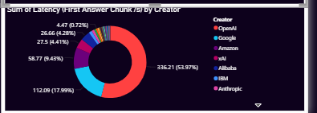
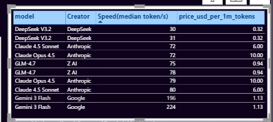

# AI-model-analysis
# AI Model Performance & Cost Analysis Dashboard

## Project Overview
This project focuses on analyzing and comparing the performance of various AI models based on
multiple parameters such as intelligence score, pricing, latency, and context window capacity.
The objective is to extract meaningful insights from the data and present them through a
clear, interactive, and visually appealing Power BI dashboard.

The project demonstrates an end-to-end data analytics workflow, including data cleaning using
Python and data visualization using Power BI.

---

## Project Objectives
- To clean and preprocess raw AI model performance data
- To analyze relationships between intelligence, price, latency, and context window
- To create an interactive and colorful dashboard for decision-making
- To present insights in a business-friendly and visual manner

---

## Tools & Technologies Used
- **Python** – for data cleaning and preprocessing
- **Pandas** – handling missing values, duplicates, and data transformation
- **Power BI** – dashboard creation and data visualization
- **CSV Dataset** – source data
- **GitHub** – project version control and sharing

---

## Dataset Description
The dataset contains information about different AI models with the following attributes:

- **Model**: Name of the AI model  
- **Intelligence Index**: Performance score of the model  
- **Price (USD per 1M Tokens)**: Cost associated with the model  
- **Context Window (K)**: Maximum number of tokens supported  
- **Latency (First Answer Chunk / s)**: Response time of the model  

---

## Data Cleaning & Preprocessing
Data cleaning was performed using Python and Pandas to ensure accuracy and consistency.

The following steps were applied:
- Checked and handled missing values
- Removed duplicate records
- Converted numerical columns to proper data types
- Standardized context window values into thousands (K)
- Filled missing Intelligence Index values using mean-based imputation
- Saved a cleaned dataset for visualization

This step ensured that the data was reliable and ready for analysis.

---

## Power BI Dashboard Description

### KPI Cards
- Average Intelligence Index  
- Average Price per 1M Tokens  
- Maximum Context Window  
- Total Number of AI Models  

These KPIs provide a quick summary of overall dataset performance.

  

---

### Bar Chart – Intelligence Index by Model

Displays the average intelligence score for each AI model.
Helps identify high-performing models.

  

Shows a cost comparison across different AI models.
Useful for identifying affordable and premium models.

  

Compares the maximum context window capacity of each model.
Highlights models suitable for long-context tasks.

  

Illustrates response time differences among models.
Lower latency indicates faster responses.

  

Demonstrates the relationship between model performance and cost.
Bubble size represents context window capacity.

  

Shows how AI models are distributed across different context window ranges.

  

Provides a detailed comparison of all AI models with conditional formatting
for easier interpretation.

  

  
</p
---

## Project Files
- Cleaned dataset (CSV)
- Python data cleaning script
- Power BI dashboard file (.pbix)

---

## Author
**Aakansha Patidar**

---

## Acknowledgement
This project was created as part of a data analytics learning journey to gain
hands-on experience in real-world data analysis and visualization.

